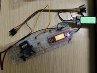
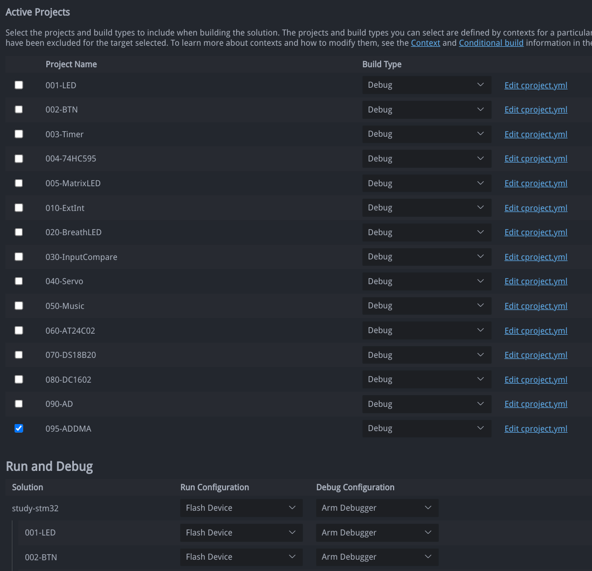

# study-stm32

学习STM32。

环境: `Linux` (`UnionTech OS`)

IDE： `VSCode`的`Arm Keil Studio Pack (MDK v6)`扩展

开发板： `Abrobot`的`STM32F103 TFT`。

## 场景图

## 说明

每一个`Project`都是独立的程序，因此同一时间需要激活其中一个，在`Manage Solution`里面选择如下：

*烧录可以使用`.vscode/tasks.json`的`ST Flash`，比`arm-debugger.flash`快多了，还支持烧录完`Reset & Run`。*
